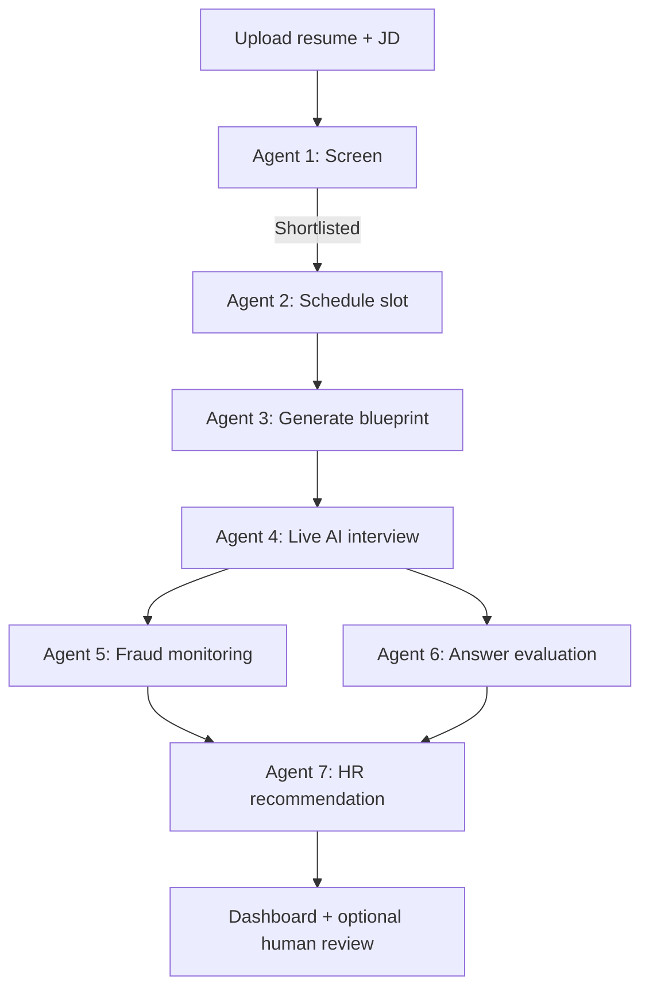

# Enterprise Architecture Guide

How to evolve **Interview Agentic AI** from the current MVP (Agents 1–2) into a production-grade, fully automated interview platform (Agents 1–7) on Azure.

---

## 1. Product vision

| Agent | Responsibility | Models / tech (target) | Status in repo |
|-------|----------------|------------------------|----------------|
| **Agent 1** | Resume screening & ATS scoring | Docling, Groq / LLM | **Built** |
| **Agent 2** | Interview scheduling & invites | LangGraph, SMTP, Google Calendar | **Built** |
| **Agent 3** | Interview strategy & blueprint | Deterministic planner (Agent 3.1) | **Built** |
| **Agent 4** | Live AI interviewer | Whisper, GPT (conversation), TTS | Planned |
| **Agent 5** | Fraud & proctoring | YOLOv8, InsightFace, MediaPipe, SpeechBrain, pyannote, browser APIs | Planned |
| **Agent 6** | Technical answer evaluation | GPT, ChromaDB, PostgreSQL | Planned |
| **Agent 7** | HR recommendation report | GPT, ChromaDB, PostgreSQL | Planned |

**End state:** No human interviewer in the loop. HR uses dashboards for oversight; candidates complete AI-led interviews at scale.

---

## 2. Current system limits (honest baseline)

Understanding today’s constraints prevents wrong scaling assumptions.

### Agent 1 — Screening

| Aspect | Today |
|--------|--------|
| Processing model | **Async queue** — `POST /api/candidates/evaluate/async` returns `202` immediately |
| Batch API | `POST /api/candidates/evaluate/batch/async` — up to **100** resumes per request |
| Queue storage | PostgreSQL `screening_jobs` table |
| Workers | Embedded pool on API startup (default **20** concurrent jobs) |
| Standalone workers | `python -m workers.screening_worker` (set `SCREENING_EMBED_WORKERS=false`) |
| Rate limiting | Bounded by `MAX_CONCURRENT_SCREENING_JOBS` (default 20, max 100) |
| Upload limit | 15 MB per file (`MAX_UPLOAD_SIZE_MB`) |
| LLM | Groq, 45s timeout, 1 retry |
| Poll for results | `GET /api/candidates/evaluate/jobs/{job_id}` |
| Queue monitoring | `GET /api/candidates/evaluate/queue/stats` |
| 100 resumes at once | **Supported** — all accepted into queue; workers process in parallel |

### Agent 2 — Scheduling

| Aspect | Today |
|--------|--------|
| Slots | 1 candidate per time slot (DB row lock) |
| Default capacity | ~7 interviews/week (Mon–Wed template), ~14 slots in a 2-week window |
| Same-time interviews | **1** (slots do not overlap) |
| LangGraph checkpoint | In-memory (`MemorySaver`) — **single API instance only** |
| Email | SMTP; failures block invite workflow |
| Token policy | New invite expires previous unused links |

### Agents 3–7

Not implemented. **Live interview capacity (Agent 4 + 5) will be the main bottleneck** for the full product.

---

## 3. Enterprise capacity model

### Rule 1: Slots ≠ interview capacity (future)

Today a slot means “one person at this time.” For AI interviews, change the model to:

```
Time window (e.g. Mon 10:00)
    └── capacity = N parallel interview workers
            └── each worker = 1 live session (Agent 4 + 5 + 6)
```

**Interviews at the same clock time** = `min(open worker slots, API/GPU limits)`, not “unlimited because Azure.”

### Rule 2: Screening scales with workers, not web servers

```
Upload API  →  accept job  →  queue  →  N screening workers  →  DB
```

100 resumes **submitted** at once: OK if API returns `202 Accepted` and queues work.  
100 resumes **parsed in parallel** on one VM: not realistic.

### Rule 3: Live interviews scale with GPU + session orchestration

| Deployment | Approx. parallel live interviews* |
|------------|-----------------------------------|
| Single CPU VM (8 vCPU) | 2–5 |
| 1× GPU VM (T4 / A10) | 10–25 |
| GPU pool + queue (AKS) | 50–200+ |
| Fully managed APIs (STT/TTS/LLM only) | Limited by budget & provider RPM |

\*Depends on model sizes, interview length, and whether STT/TTS run locally or via API.

### Suggested environment knobs (add when building Agents 3–7)

```env
# Screening
MAX_CONCURRENT_SCREENING_JOBS=20
SCREENING_QUEUE_NAME=resume-screening

# Live interviews
MAX_CONCURRENT_LIVE_INTERVIEWS=25
INTERVIEW_SESSION_TIMEOUT_MINUTES=60
INTERVIEW_QUEUE_MAX_WAIT_MINUTES=120

# Per time window (scheduling UI)
SLOTS_PER_TIME_WINDOW=25

# LLM throttling
LLM_MAX_CONCURRENT_REQUESTS=15
LLM_REQUESTS_PER_MINUTE=120
```

---

## 4. Target Azure reference architecture

```
                         Azure Front Door / Application Gateway
                                    │
          ┌─────────────────────────┼─────────────────────────┐
          ▼                         ▼                         ▼
    React Web App            FastAPI API Gateway        WebSocket / SignalR
    (candidate + HR)         (REST, auth, uploads)       (live interview)
          │                         │                         │
          │                         ├──────── PostgreSQL ─────┤
          │                         ├──────── Redis ──────────┤  (sessions, locks)
          │                         │                         │
          │              Azure Service Bus / Storage Queue  │
          │                    ┌────┴────┬────────┬────────┴────┐
          │                    ▼         ▼        ▼             ▼
          │            Screening   Blueprint  Interview    Report
          │            Workers     Workers    GPU Workers  Workers
          │            (Agent 1)   (Agent 3)  (Agent 4–6)  (Agent 7)
          │                                         │
          └──────────── Azure Blob Storage ─────────┘
                    (resumes, JDs, recordings, artifacts)
                              │
                    ChromaDB / Azure AI Search
                    (rubrics, expected answers, embeddings)
```

### Recommended Azure services

| Concern | Service |
|---------|---------|
| Compute (API) | Azure Container Apps or AKS |
| Compute (GPU interviews) | AKS node pool (NC-series) or Azure ML endpoints |
| Database | Azure Database for PostgreSQL Flexible Server |
| Cache / sessions | Azure Cache for Redis |
| Queue | Azure Service Bus |
| Files | Azure Blob Storage |
| Secrets | Azure Key Vault |
| Auth | Microsoft Entra ID (B2C for candidates optional) |
| Monitoring | Application Insights + Log Analytics |
| CDN / WAF | Azure Front Door |
| Vector search | Chroma on AKS, or Azure AI Search |

---

## 5. Service decomposition (microservices boundaries)

Split by **scaling profile**, not by “one microservice per agent.”

| Service | Agents | Sync vs async | Scale driver |
|---------|--------|---------------|--------------|
| **api-gateway** | All (entry) | Sync | HTTP traffic |
| **screening-service** | 1 | Async workers | CPU, LLM RPM |
| **scheduler-service** | 2 | Sync + LangGraph | Low; stateless replicas |
| **blueprint-service** | 3 | Async | LLM |
| **interview-runtime** | 4, 5, 6 | Long-lived WebSocket | **GPU, concurrent sessions** |
| **evaluation-service** | 6 | Async post-interview | LLM + vector DB |
| **recommendation-service** | 7 | Async | LLM batch |
| **notification-service** | 2, 7 | Async | SMTP / SMS |

**Do not** run Whisper + YOLO + GPT in the same process as the main FastAPI app. Isolate **interview-runtime** on GPU nodes.

---

## 6. Data architecture

### PostgreSQL (system of record)

- Candidates, jobs, evaluations, interviews, slots, tokens, scores, fraud flags, final reports
- Use migrations (Alembic) per service or shared schema with clear ownership

### Blob storage

| Path | Content |
|------|---------|
| `resumes/{id}.pdf` | Original resume |
| `jds/{id}.pdf` | Job description |
| `recordings/{session_id}/` | Audio/video (if recorded) |
| `reports/{candidate_id}/` | Generated PDF/HTML reports |

### ChromaDB / vector store

- Company rubrics, expected answers, question banks, role-specific knowledge
- Embed once; retrieve during Agent 6 evaluation

### Redis

- Live interview session state
- Distributed locks (slot booking, worker assignment)
- Rate limit counters
- Short-lived interview auth tokens

---

## 7. End-to-end candidate flow (target)



### Timing (typical)

| Stage | Duration |
|-------|----------|
| Agent 1 | 30s – 3 min |
| Agent 2 | Seconds |
| Agent 3 | 10 – 60s |
| Agent 4 | 20 – 45 min |
| Agent 5 | Continuous during Agent 4 |
| Agent 6 | During + after interview |
| Agent 7 | 1 – 5 min |

**Platform throughput** for interviews ≈ **concurrent Agent 4 sessions**, not total shortlisted count.

---

## 8. Traffic & concurrency scenarios

| Scenario | MVP (today) | Enterprise (target) |
|----------|-------------|---------------------|
| 100 resume uploads in 1 minute | Timeouts / overload | Queue accepts all; workers drain backlog |
| 500 shortlisted candidates | OK in DB | OK; schedule over days/weeks |
| 50 pick same time slot | Only 1 books; rest fail | N workers assigned; rest queued or shown “slot full” |
| 20 live AI interviews at once | N/A | 1 GPU pool sized for 20 sessions |
| Multi-region candidates | Single server | Front Door + regional GPU pools (later phase) |
| API abuse | No protection | WAF + rate limits + auth |

### Slot booking (enterprise pattern)

1. Candidate selects time window.
2. API checks **worker pool availability** for that window (not just `is_booked`).
3. Reserve seat in Redis: `DECR available_seats:{slot_id}`.
4. On interview start, assign `worker_id` and create `interview_session`.
5. On complete/fail/timeout, release seat and persist results.

Keep PostgreSQL row locks for financial-grade booking consistency; use Redis for fast capacity counters.

---

## 9. Agent 4 + 5: Live interview runtime (critical path)

### Session lifecycle

```
JOIN → identity check → blueprint load → Q&A loop → wind-down → POST_PROCESS
         │                    │              │
    Agent 5 stream      Agent 3 context   Agent 4 + 6
```

### Per-session components

| Component | Options |
|-----------|---------|
| Speech-to-text | Whisper (GPU), Azure Speech, OpenAI |
| Conversation LLM | GPT / Groq with session memory |
| Text-to-speech | Piper (local), Azure Speech, OpenAI TTS |
| Video fraud | MediaPipe + YOLO + InsightFace on sampled frames |
| Audio fraud | SpeechBrain / pyannote on audio stream |
| Browser signals | Tab focus, copy/paste, multiple monitors (JS) |

### Design rules

1. **In-app interview room** (Agent 5 getUserMedia + WebSocket monitoring + Agent 4 STT/LLM/TTS). There is no Google Meet. A true locked-down exam client requires browser kiosk mode or a desktop app; the web app can only warn on fullscreen/tab exit.
2. **Session recorder** writes artifacts to Blob asynchronously.
3. **Circuit breaker** on LLM calls; fallback prompt if API slow.
4. **Hard timeout** per interview; release worker either way.
5. **PII**: encrypt recordings; retention policy per tenant.

---

## 10. Security & compliance (enterprise)

| Area | Requirement |
|------|-------------|
| Authentication | Entra ID for HR; magic link / OTP for candidates |
| Authorization | RBAC: recruiter, hiring manager, admin |
| Secrets | Key Vault only; never commit `.env` |
| Data residency | Choose Azure region per customer |
| Audit log | Who viewed candidate PII, who overrode AI decision |
| GDPR / consent | Recording consent, right to delete |
| Model data | No training on customer data without contract |
| Fraud evidence | Store flags + snapshots, not only boolean |

---

## 11. Observability

### Metrics to track

| Metric | Why |
|--------|-----|
| `screening_queue_depth` | Backlog pressure |
| `screening_job_duration_p95` | SLA for parse time |
| `live_interviews_active` | Real-time capacity |
| `interview_worker_utilization` | When to scale GPU pool |
| `llm_errors_rate` | Provider issues |
| `fraud_flags_per_session` | Model quality |
| `smtp_send_failures` | Invite delivery |

### Tooling

- **Application Insights** for traces across services
- **Structured logging** (JSON) with `candidate_id`, `session_id`, `agent`
- **Alerts**: queue depth > threshold, GPU > 85%, error rate spike

---

## 12. Phased roadmap

### Phase 0 — Stabilize MVP (current repo)

- [ ] Fix SMTP reliability (retry, dead-letter, dev mock)
- [ ] Replace LangGraph `MemorySaver` with **PostgreSQL checkpointer**
- [ ] HR slot management (add/edit capacity per window)
- [ ] Health checks + basic App Insights

**Outcome:** Reliable pilot for 10–50 candidates.

---

### Phase 1 — Screening at scale (Agent 1 enterprise)

- [x] PostgreSQL job queue (`screening_jobs`) + screening workers
- [x] API returns `job_id` immediately (`202 Accepted`)
- [x] Batch endpoint for up to 100 evaluations
- [x] Blob storage for all uploads (already started locally)
- [ ] LLM concurrency semaphore + retries (partial — worker pool limits concurrency)
- [x] Idempotent evaluation (same resume + JD = update, not duplicate)

**Outcome:** 100+ resumes/hour with horizontal workers.

---

### Phase 2 — Scheduling for AI interviews (Agent 2 enterprise)

- [ ] `capacity` column on slots (N parallel seats per window)
- [ ] Redis seat reservation
- [ ] Interview session table linked to slot
- [ ] Waitlist when window full
- [ ] Multi-instance API (stateless + Postgres checkpoints)

**Outcome:** Many candidates can share a time window; bounded by worker pool.

---

### Phase 3 — Blueprint agent (Agent 3)

- [ ] Job role templates in DB
- [ ] Generate question plan from JD + resume + difficulty
- [ ] Store blueprint JSON before interview
- [ ] HR preview / override optional

**Outcome:** Structured interviews, not ad-hoc chat.

---

### Phase 4 — Live interview MVP (Agent 4)

- [ ] WebSocket interview UI
- [ ] STT → LLM → TTS loop
- [ ] Session manager + worker assignment
- [ ] 5–10 concurrent sessions on GPU VM

**Outcome:** First fully automated interviews without human HR.

---

### Phase 5 — Proctoring (Agent 5)

- [ ] Browser monitoring SDK
- [ ] Face / gaze / multiple-person detection
- [ ] Voice consistency checks
- [ ] Fraud score persisted per session

---

### Phase 6 — Evaluation & recommendation (Agents 6–7)

- [ ] ChromaDB rubrics + retrieval
- [ ] Per-question scoring
- [ ] Final report PDF + HR dashboard
- [ ] Salary band suggestion (configurable, jurisdiction-aware)

---

### Phase 7 — Enterprise hardening

- [ ] Multi-tenant (company_id on all rows)
- [ ] SSO, audit logs, data retention jobs
- [ ] Auto-scale GPU node pool
- [ ] DR: Postgres geo-backup, Blob redundancy
- [ ] Load testing (k6): 100 uploads, 50 concurrent sessions

---

## 13. Repository evolution (suggested layout)

```
Interview_Agentic_AI/
├── backend/
│   ├── agents/
│   │   ├── screening_agent/    # Agent 1
│   │   ├── scheduler_agent/    # Agent 2
│   │   ├── blueprint_agent/    # Agent 3
│   │   └── recommendation_agent/ # Agent 7 orchestration
│   ├── services/
│   ├── workers/                # NEW: queue consumers
│   │   ├── screening_worker.py
│   │   └── report_worker.py
│   └── interview_runtime/      # NEW: Agent 4–6 WebSocket service
│       ├── session_manager.py
│       ├── stt_pipeline.py
│       ├── tts_pipeline.py
│       └── fraud_pipeline.py
├── frontend/
│   ├── src/                    # HR + scheduling
│   └── interview/              # NEW: live interview UI
├── infra/                      # NEW: Bicep / Terraform for Azure
│   ├── main.bicep
│   └── aks-gpu-pool.bicep
├── docs/
│   └── ENTERPRISE_ARCHITECTURE.md
└── docker-compose.yml          # local dev; production uses Azure
```

Start with **`workers/`** and **Postgres LangGraph checkpoint** before building Agent 4.

---

## 14. Cost drivers (planning)

| Driver | Scales with |
|--------|-------------|
| GPU VM hours | Concurrent live interviews |
| LLM tokens | Resume count + interview length + report depth |
| Whisper / STT minutes | Interview duration × sessions |
| TTS characters | Agent 4 verbosity × sessions |
| Blob storage | Recordings retained |
| PostgreSQL | Candidate volume (usually modest) |

**Cheapest pilot:** API-based STT/TTS/LLM, no recording, 5 concurrent cap.  
**Production:** Reserved GPU + queue + autoscale.

---

## 15. Definition of “enterprise ready”

Use this checklist before calling the platform enterprise-grade:

- [ ] Horizontal scaling for API and workers
- [ ] No in-memory-only workflow state in production
- [ ] Queue-backed screening and reporting
- [ ] Bounded concurrent live interviews with queue UX
- [ ] Auth, RBAC, audit logs
- [ ] Secrets in Key Vault
- [ ] Monitoring, alerting, runbooks
- [ ] Load test report (documented RPS and concurrent interviews)
- [ ] Data retention and deletion process
- [ ] Incident response for model failures (fallbacks, not 500s mid-interview)

---

## 16. Immediate next steps in this repo

1. **Postgres checkpointer** for LangGraph (required before Azure multi-instance).
2. **Screening job queue** (even Redis + ARQ locally first).
3. **Slot `capacity` field** + seat reservation design for future Agent 4 workers.
4. **Separate `interview_runtime` service** skeleton (WebSocket health endpoint).
5. **Link this doc from README** and track phases in GitHub Projects.

---

## 17. Related reading

- Current quick start: [README.md](../README.md)
- Slot logic: `backend/services/slot_service.py`
- Screening limits: `backend/agents/screening_agent/config.py`
- Scheduler workflow: `backend/agents/scheduler_agent/graph.py`

---

*Last updated: July 2026 — aligned with Agents 1–2 in repo and planned Agents 3–7.*
